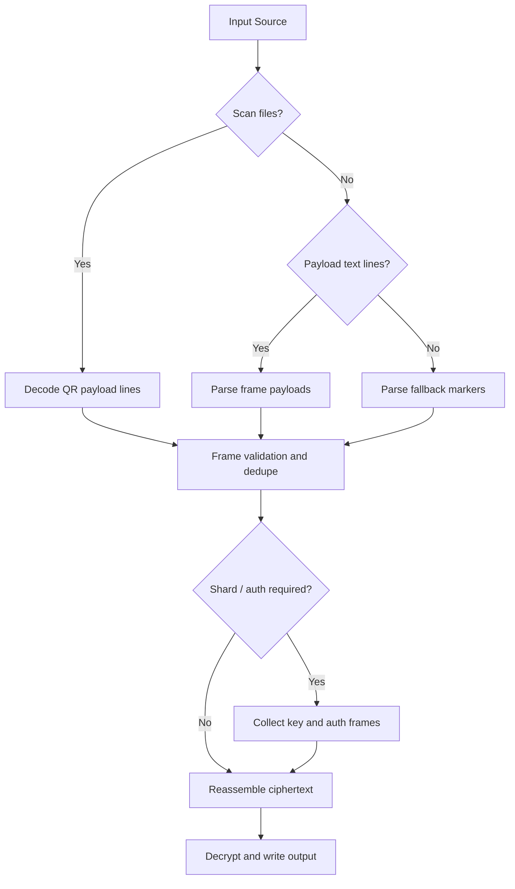

<a id="readme-top"></a>

[![Contributors][contributors-shield]][contributors-url]
[![Forks][forks-shield]][forks-url]
[![Stargazers][stars-shield]][stars-url]
[![Issues][issues-shield]][issues-url]
[![License][license-shield]][license-url]
[](https://www.python.org/downloads/)

<div align="center">
  
  <h1 align="center">Ethernity</h1>
  <p align="center">
    Secure, offline-recoverable backups with printable QR documents and a browser recovery kit.
    <br />
    <a href="docs/format.md"><strong>Format spec</strong></a>
    &middot;
    <a href="docs/format_notes.md"><strong>Format notes</strong></a>
    &middot;
    <a href="SECURITY.md"><strong>Security policy</strong></a>
    <br />
    <a href="https://github.com/MinorGlitch/ethernity/issues">Issues</a>
    &middot;
    <a href="https://github.com/MinorGlitch/ethernity/issues/new?labels=bug">Report Bug</a>
    &middot;
    <a href="https://github.com/MinorGlitch/ethernity/issues/new?labels=enhancement">Request Feature</a>
  </p>
</div>

## Table of Contents

Start here: [Quick Start](#quick-start)

- [Status (Experimental)](#status-experimental)
- [What Is Ethernity?](#what-is-ethernity)
- [Who It's For / Not For](#who-its-for--not-for)
- [Quick Start](#quick-start)
- [Workflow Playbooks](#workflow-playbooks)
- [How Recovery Inputs Work](#how-recovery-inputs-work)
- [Command Cheatsheet](#command-cheatsheet)
- [Security at a Glance](#security-at-a-glance)
- [Release Artifacts](#release-artifacts)
- [Troubleshooting (Quick Fixes)](#troubleshooting-quick-fixes)
- [Development Quickstart](#development-quickstart)
- [Contributing](#contributing)
- [License](#license)

## Status (Experimental)

Ethernity is still experimental and under active development.

The document format, CLI behavior, and operational workflows can still change between releases.
Backward compatibility is not guaranteed across pre-stable versions.

Do not rely on Ethernity as your only backup system.
Run regular recovery drills and keep at least one independent backup path.

## What Is Ethernity?

Ethernity is a Python CLI that turns sensitive files into encrypted, printable recovery artifacts.
The output combines machine-readable QR payloads with human-readable fallback text,
so you can recover data offline even if scanning fails.

A bundled browser recovery kit can reconstruct and decrypt backups locally,
without calling cloud services or online APIs.
This is designed for high-friction, low-dependency recovery scenarios where physical media matters.

Ethernity is opinionated around verifiability:
formats are documented, payload structures are explicit, and release artifacts include provenance material.

### Built With

| Area | Primary Components |
| --- | --- |
| CLI and UX | Typer, Rich, Questionary |
| Crypto | age (pyrage), Shamir sharing, Ed25519 signing |
| Rendering | fpdf2, Jinja2, Playwright |
| Encoding | CBOR, QR framing, z-base-32 fallback blocks |
| Packaging | PyInstaller onedir releases + Sigstore bundles |

## Who It's For / Not For

Ethernity is a good fit if you need:

- offline-capable secret recovery workflows
- printable artifacts for long-term or distributed physical custody
- threshold-shared recovery for multi-party control
- auditable data handling steps instead of black-box cloud backup behavior

Ethernity is usually not a good fit if you need:

- always-on background synchronization
- turnkey, no-maintenance backup infrastructure
- guaranteed backward compatibility across rapidly evolving pre-stable versions
- centralized managed recovery operated by a third-party service

## Quick Start

### Prerequisites

- Python 3.13+ (for source and pip-based installs)
- `cosign` only if you verify release artifacts
- Chromium binaries for PDF rendering (auto-installed on first backup/render run)
- local disk space for generated PDFs and optional shard documents

### 1) Install from Release Artifacts (Recommended)

Release binaries are the fastest onboarding path. Download the archive matching your OS and CPU.

Artifact naming:

```text
ethernity-{tag}-{os}-{arch}.{zip|tar.gz}
```

Download and verify on Linux/macOS:

```sh
TAG="vX.Y.Z"
OS_ARCH="linux-x64"
BASE="ethernity-${TAG}-${OS_ARCH}.tar.gz"

curl -LO "https://github.com/MinorGlitch/ethernity/releases/download/${TAG}/${BASE}"
curl -LO "https://github.com/MinorGlitch/ethernity/releases/download/${TAG}/${BASE}.sigstore.json"

cosign verify-blob --bundle "${BASE}.sigstore.json" "${BASE}"

tar -xzf "${BASE}"
./ethernity-${TAG}-${OS_ARCH}/ethernity --help
```

Windows PowerShell equivalent:

```powershell
$Tag = "vX.Y.Z"
$OsArch = "windows-x64"
$Base = "ethernity-$Tag-$OsArch.zip"

Invoke-WebRequest "https://github.com/MinorGlitch/ethernity/releases/download/$Tag/$Base" -OutFile $Base
Invoke-WebRequest "https://github.com/MinorGlitch/ethernity/releases/download/$Tag/$Base.sigstore.json" -OutFile "$Base.sigstore.json"

cosign verify-blob --bundle "$Base.sigstore.json" "$Base"

Expand-Archive -Path $Base -DestinationPath .
.\ethernity-$Tag-$OsArch\ethernity.exe --help
```

For full verification and provenance guidance, use
[`docs/release_artifacts.md`](docs/release_artifacts.md).

### 2) Install via pipx or pip

When `ethernity` is available on PyPI, `pipx` and `pip` are valid install paths.

`pipx` is recommended when you want isolated CLI installation:

```sh
pipx install ethernity
ethernity --help
```

`pip` is acceptable inside an existing Python environment:

```sh
pip install ethernity
ethernity --help
```

### 3) Install from Source (Development or Audit)

```sh
git clone https://github.com/MinorGlitch/ethernity.git
cd ethernity
uv sync --extra dev --extra build
uv run ethernity --help
```

### 4) First Backup

Create a backup:

```sh
ethernity backup --input ./secrets.txt --output-dir ./backup-demo
```

Common outputs:

| File | Purpose |
| --- | --- |
| `qr_document.pdf` | primary scan source for payload recovery |
| `recovery_document.pdf` | fallback text and metadata recovery path |
| `shard_*.pdf` (optional) | threshold shard artifacts when sharding enabled |
| `signing_key_shard_*.pdf` (optional) | separate signing-key shard artifacts |

### 5) First Recovery

Recover from scans:

```sh
ethernity recover --scan ./backup-demo --output ./restored.bin
```

For fallback-text and shard-driven recovery paths, use playbooks C and D below.

### 6) Generate Recovery Kit

```sh
ethernity kit --output ./recovery_kit_qr.pdf
```

### Minimal End-to-End Happy Path

```sh
# 1) Create sample input
printf '{"vault":"demo"}\n' > vault-export.json

# 2) Backup
ethernity backup --input ./vault-export.json --output-dir ./demo-backup

# 3) Recover from scans
ethernity recover --scan ./demo-backup --output ./vault-export.recovered.json

# 4) Validate payload equality
cmp ./vault-export.json ./vault-export.recovered.json
```

Expected result: `cmp` exits with status `0` and recovered JSON is byte-identical.

## Workflow Playbooks

Use these templates as runbook starters. Keep one playbook per recovery scenario.

### Playbook A: Single-File Secret Backup

Use this when you need to protect one high-value file quickly.

```sh
ethernity backup \
  --input ./seed-phrase.txt \
  --output-dir ./ops/single-secret \
  --paper A4 \
  --design forge
```

Operator checklist:

- [ ] Confirm input file is the exact intended payload
- [ ] Separate custody of QR doc, recovery doc, and passphrase
- [ ] Run one recovery drill from this exact artifact set

### Playbook B: Directory Backup with Sharding

Use this for multi-file backups where passphrase control should be distributed.

```sh
ethernity backup \
  --input-dir ./critical-config \
  --output-dir ./ops/sharded-config \
  --shard-threshold 2 \
  --shard-count 3 \
  --signing-key-mode sharded \
  --signing-key-shard-threshold 2 \
  --signing-key-shard-count 3
```

Operator checklist:

- [ ] Confirm threshold/count values match policy
- [ ] Ensure each custodian receives only assigned shard document
- [ ] Test recovery with the minimum threshold set

### Playbook C: Offline Recovery from Scans

Use this when restoring from camera captures, scanned pages, or exported QR frames.

```sh
ethernity recover \
  --scan ./incident/scans \
  --output ./incident/recovered.tar
```

If auth material is provided separately:

```sh
ethernity recover \
  --scan ./incident/scans \
  --auth-payloads-file ./incident/auth_payloads.txt \
  --output ./incident/recovered.tar
```

Operator checklist:

- [ ] Confirm scan directory contains only intended backup materials
- [ ] Validate recovered output hash/bytes against a trusted reference
- [ ] Preserve original scan exports until validation completes

### Playbook D: Fallback-Text-First Recovery

Use this when scans are unavailable or damaged, but fallback blocks are intact.

```sh
ethernity recover \
  --fallback-file ./incident/recovery_fallback.txt \
  --output ./incident/recovered.bin
```

Interactive stdin path:

```sh
cat ./incident/recovery_fallback.txt | ethernity recover --fallback-file - --output ./incident/recovered.bin
```

Operator checklist:

- [ ] Preserve original fallback source before manual cleanup
- [ ] Keep fallback/shard inputs grouped by document id
- [ ] Verify output hash and rerun with a fresh copy on parser errors

## How Recovery Inputs Work

### Recovery Input Data Flow



### Input Source Selection Tips

| Situation | Best Input Path |
| --- | --- |
| Clean QR scans available | `--scan` |
| QR lines copied from logs/exports | `--payloads-file` |
| Scan quality poor but fallback text present | `--fallback-file` |
| Partial scans plus shard text files | `--scan` + `--shard-fallback-file` |

## Command Cheatsheet

### Core Commands by Task

| Task | Command |
| --- | --- |
| Show global help | `ethernity --help` |
| Show backup help | `ethernity backup --help` |
| Show recover help | `ethernity recover --help` |
| Create backup | `ethernity backup --input ./file.txt --output-dir ./backup-out` |
| Recover from scans | `ethernity recover --scan ./scan-dir --output ./restored.bin` |
| Recover from fallback text | `ethernity recover --fallback-file ./fallback.txt --output ./restored.bin` |
| Generate recovery kit PDF | `ethernity kit --output ./recovery_kit_qr.pdf` |

### Global Overrides

| Category | Flags | Meaning | Example |
| --- | --- | --- | --- |
| Config | `--config` | use custom config file | `ethernity --config ./ops/config.toml backup ...` |
| Layout | `--paper`, `--design` | override paper/design for this run | `ethernity --paper Letter --design forge backup ...` |
| Debug | `--debug`, `--debug-max-bytes`, `--debug-reveal-secrets` | inspect internals with masked-by-default secrets | `ethernity --debug --debug-max-bytes 4096 backup ...` |
| Output | `--quiet` | suppress non-error output | `ethernity --quiet recover ...` |

Use `--debug-reveal-secrets` only in controlled environments and never in shared terminals/log collectors.
Debug output is richer in interactive terminals and automatically falls back to plain text in redirected logs.

```sh
# Safe debug (masked secrets)
ethernity --debug backup --input ./secret.txt --output-dir ./backup-out

# Recover debug (masked secrets)
ethernity --debug recover --scan ./backup-demo --output ./restored.bin
```

### Template Config (Design Names)

Template sections in `config.toml` are design-name based.
Use `name = "<design>"` in each template section.

```toml
[templates]
default_name = "sentinel"

[template]
name = "sentinel"

[recovery_template]
name = "sentinel"

[shard_template]
name = "sentinel"

[signing_key_shard_template]
name = "monograph"

[kit_template]
name = "sentinel"
```

### Operator Defaults in Config

Use `config.toml` defaults to reduce repeated flags.
Resolution order is `CLI > Env > Config > built-in`.

One-way boolean caveat:
- `quiet`, `no_color`, and `no_animations` are OR-style.
- CLI can force them on, but there are no inverse flags to force them off in this wave.

Runtime/defaults notes:
- `debug.max_bytes = 0` means unset and falls back to the CLI default behavior.
- `ETHERNITY_RENDER_JOBS` overrides `[runtime].render_jobs` when set.

```toml
[defaults.backup]
base_dir = ""
output_dir = ""
shard_threshold = 0
shard_count = 0
signing_key_mode = "" # embedded | sharded
signing_key_shard_threshold = 0
signing_key_shard_count = 0

[defaults.recover]
output = ""

[ui]
quiet = false
no_color = false
no_animations = false

[debug]
max_bytes = 1024

[runtime]
render_jobs = "auto" # or positive integer
```

Safety policy:
- risky recovery bypass controls remain explicit CLI-only decisions
- config defaults intentionally do not support `--rescue-mode` or `--yes`

## Security at a Glance

Ethernity helps protect against:

- data loss in low-connectivity or offline-only scenarios
- accidental corruption through frame-level validation and integrity checks
- single-holder compromise when threshold sharding is used correctly

Ethernity does not protect against:

- compromised endpoints at backup or recovery time
- weak, reused, or leaked passphrases
- policy failures in shard custody distribution
- operational mistakes that skip recovery drills

Hard warning:

- do not treat generated artifacts as magically safe by default
- security outcome depends on custody controls, passphrase quality, and tested runbooks

Read full policy and reporting guidance in [`SECURITY.md`](SECURITY.md).

For format-level guarantees and bounds, use:

- [`docs/format.md`](docs/format.md)
- [`docs/format_notes.md`](docs/format_notes.md)

## Release Artifacts

Release archive naming:

```text
ethernity-{tag}-{os}-{arch}.{zip|tar.gz}
```

Published variant summary:

| OS | Architectures | Archive |
| --- | --- | --- |
| Linux | x64, arm64 | `tar.gz` |
| macOS | x64, arm64 | `tar.gz` |
| Windows | x64 | `zip` |

Companion verification/provenance files:

| File | Role |
| --- | --- |
| `*.sbom.cdx.json` | CycloneDX software bill of materials |
| `*.sigstore.json` | Sigstore bundle for signed artifacts (archive and SBOM) |
| `*.sig` / `*.pem` | optional detached signature/certificate path |

Quick verification path:

```sh
BASE="ethernity-vX.Y.Z-linux-x64.tar.gz"
cosign verify-blob --bundle "${BASE}.sigstore.json" "${BASE}"
```

Use the full release verification guide for complete steps and troubleshooting:
[`docs/release_artifacts.md`](docs/release_artifacts.md).

## Troubleshooting (Quick Fixes)

Use this section for common onboarding blockers.
Rows follow the onboarding sequence: install/run, verification, then recovery.

| Stage | Symptom | Quick fix |
| --- | --- | --- |
| Install/Run | Binary fails with wrong architecture | Download the artifact matching your OS and CPU (`x64` or `arm64`). |
| Install/Run | `playwright` errors during backup/render | Re-run the command and allow startup to install Chromium; unset `ETHERNITY_SKIP_PLAYWRIGHT_INSTALL` if set. |
| macOS Launch | `library load disallowed by system policy` | Verify the archive first, then apply local unblock steps. See `macOS Local Unblock` below. |
| Verification | `cosign verify-blob` fails | Verify the exact archive with the matching `.sigstore.json` bundle from the same tag. |
| Verification | expecting `.sig`/`.pem` but release has only `.sigstore.json` | This is valid for bundle-first signing; use `cosign verify-blob --bundle ...`. |
| Recovery Input | parser rejects mixed payload text | Split by document set and recover one mode/source at a time. |
| Recovery Input | `manifest input_origin is required`, `manifest input_roots is required`, `manifest path_encoding is required`, or `manifest file entry must use array encoding` | Manifest schema mismatch; recreate the backup with the current release. |
| Recovery Input | `No such option` | Use `ethernity <command> --help` and current flags (for example `--qr-chunk-size`). |
| Recovery Validation | recovered output seems wrong | Compare hashes/bytes against a trusted source and retry with fresh inputs. |

### macOS Local Unblock

Symptom:

- running `./ethernity` fails with `library load disallowed by system policy`.

Only after `cosign verify-blob --bundle ...` succeeds:

```sh
cd ~/Downloads
DIR="ethernity-vX.Y.Z-macos-arm64"

xattr -dr com.apple.quarantine "${DIR}"
codesign --force --deep --sign - "${DIR}/ethernity"
"${DIR}/ethernity" --help
```

Apply this only to a trusted archive you have already verified.

### Provenance Bundle Confusion

Symptom:

- expecting `.sig`/`.pem` files, but release includes only `.sigstore.json`.

Fix:

- bundle-first signing is expected
- `.sigstore.json` is the primary verification artifact
- `.sig`/`.pem` are optional detached files
- verify with:

```sh
cosign verify-blob --bundle "ethernity-vX.Y.Z-linux-x64.tar.gz.sigstore.json" "ethernity-vX.Y.Z-linux-x64.tar.gz"
```

### Payload and Fallback Input Mistakes

Symptom:

- recovery errors mentioning invalid line format, unexpected frame type, or mixed documents.

Fix:

- keep one document id per recovery attempt
- avoid copying wrapped text that inserts extra whitespace
- retry with exact exported lines or fallback source file
- add shard/auth inputs only from the same backup set

## Development Quickstart

```sh
git clone https://github.com/MinorGlitch/ethernity.git
cd ethernity
uv sync --extra dev --extra build
uv run playwright install chromium
```

Core checks:

```sh
uv run pytest tests/unit tests/integration -q
uv run ruff check src tests
uv run ruff format --check src tests
uv run mypy src
cd kit
npm ci
node build_kit.mjs
cd ..
```

Use [`CONTRIBUTING.md`](CONTRIBUTING.md) for workflow policy, expectations, and quality gates.

## Contributing

Contributions are welcome. Prefer focused PRs with tests/docs updates when behavior changes.
Before opening a PR, read [`CONTRIBUTING.md`](CONTRIBUTING.md), [`SECURITY.md`](SECURITY.md), and [`AGENTS.md`](AGENTS.md).

## License

GPLv3 or later. See [`LICENSE`](LICENSE) for full terms.
<p align="right">(<a href="#readme-top">back to top</a>)</p>

[contributors-shield]: https://img.shields.io/github/contributors/MinorGlitch/ethernity.svg?style=for-the-badge
[contributors-url]: https://github.com/MinorGlitch/ethernity/graphs/contributors
[forks-shield]: https://img.shields.io/github/forks/MinorGlitch/ethernity.svg?style=for-the-badge
[forks-url]: https://github.com/MinorGlitch/ethernity/network/members
[stars-shield]: https://img.shields.io/github/stars/MinorGlitch/ethernity.svg?style=for-the-badge
[stars-url]: https://github.com/MinorGlitch/ethernity/stargazers
[issues-shield]: https://img.shields.io/github/issues/MinorGlitch/ethernity.svg?style=for-the-badge
[issues-url]: https://github.com/MinorGlitch/ethernity/issues
[license-shield]: https://img.shields.io/github/license/MinorGlitch/ethernity.svg?style=for-the-badge
[license-url]: https://github.com/MinorGlitch/ethernity/blob/master/LICENSE
