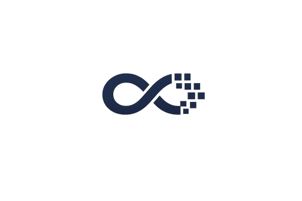
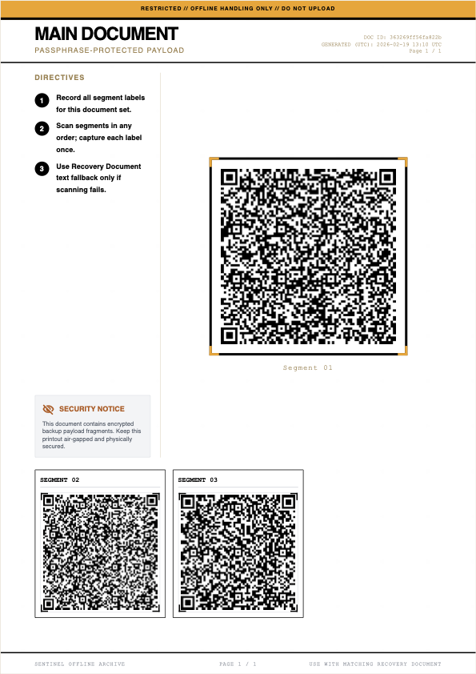
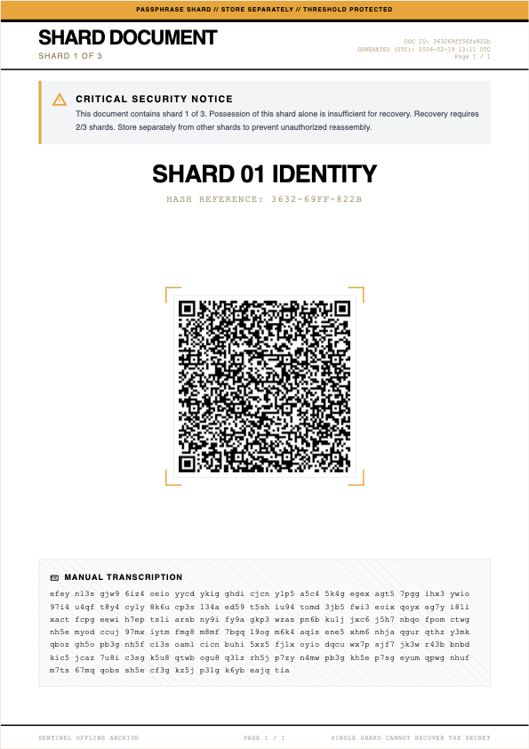
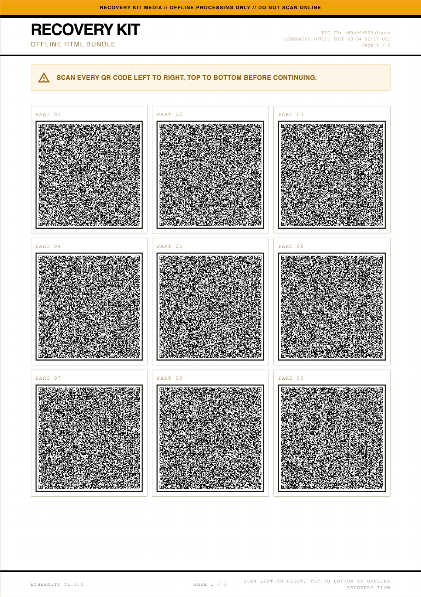
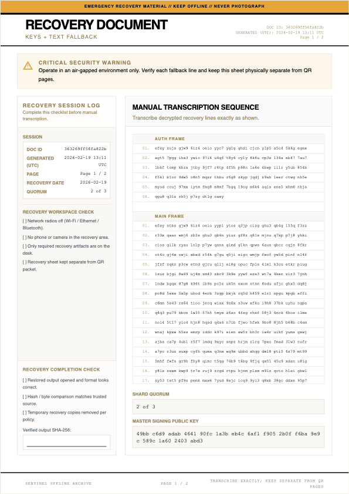
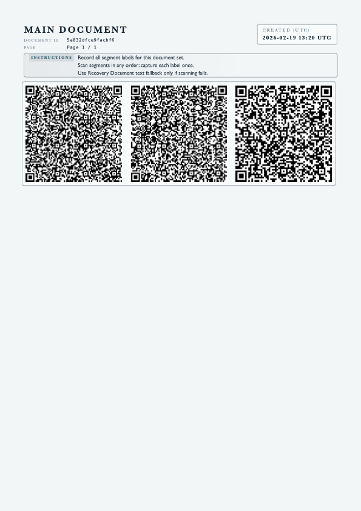
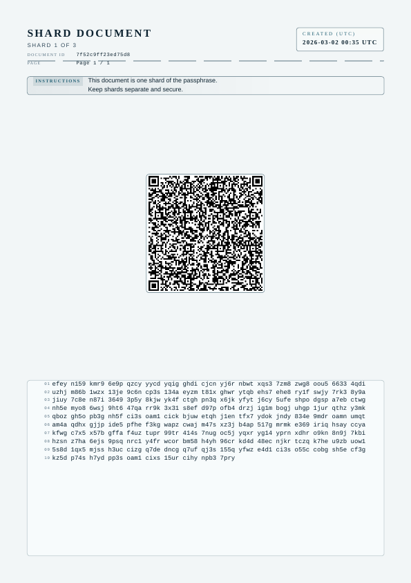
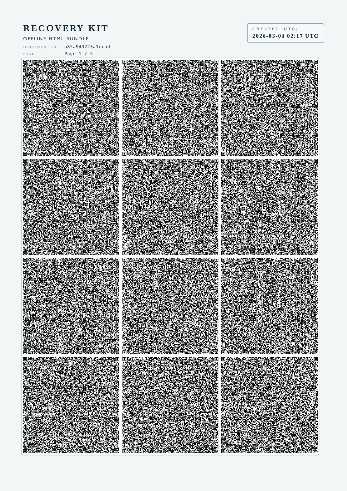
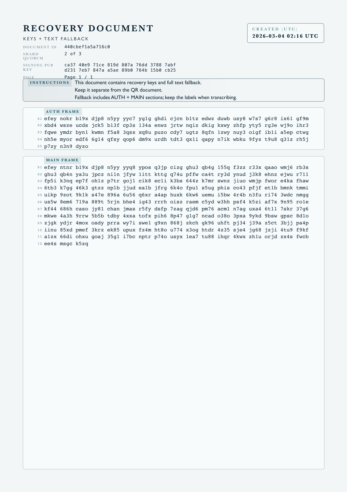

<a id="readme-top"></a>

[![Contributors][contributors-shield]][contributors-url]
[![Forks][forks-shield]][forks-url]
[![Stargazers][stars-shield]][stars-url]
[![Issues][issues-shield]][issues-url]
[![License][license-shield]][license-url]
[](https://www.python.org/downloads/)

<div align="center">
  
  <h1 align="center">Ethernity</h1>
  <p align="center">
    Secure, offline-recoverable backups with printable QR documents and a browser recovery kit.
    <br />
    <a href="docs/format.md"><strong>Format spec</strong></a>
    &middot;
    <a href="docs/format_notes.md"><strong>Format notes</strong></a>
    &middot;
    <a href="SECURITY.md"><strong>Security policy</strong></a>
    <br />
    <a href="https://github.com/MinorGlitch/ethernity/issues">Issues</a>
    &middot;
    <a href="https://github.com/MinorGlitch/ethernity/issues/new?labels=bug">Report Bug</a>
    &middot;
    <a href="https://github.com/MinorGlitch/ethernity/issues/new?labels=enhancement">Request Feature</a>
  </p>
</div>

## Table of Contents

Start here: [Quick Start](#quick-start)

- [Status](#status)
- [What Is Ethernity?](#what-is-ethernity)
- [What Ethernity Supports](#what-ethernity-supports)
- [Who It's For / Not For](#who-its-for--not-for)
- [Document Previews](#document-previews)
- [Quick Start](#quick-start)
- [First Backup](#first-backup)
- [First Recovery](#first-recovery)
- [Troubleshooting (Quick Fixes)](#troubleshooting-quick-fixes)
- [Workflow Playbooks](#workflow-playbooks)
- [Security at a Glance](#security-at-a-glance)
- [How Recovery Inputs Work](#how-recovery-inputs-work)
- [Command Cheatsheet](#command-cheatsheet)
- [Release Artifacts](#release-artifacts)
- [Development Quickstart](#development-quickstart)
- [Contributing](#contributing)
- [Credits](#credits)
- [Star History](#star-history)
- [License](#license)

## Status

- Good news: Ethernity is now stable.
- Backups and recovery artifacts follow the baseline in `docs/format.md`.
- Future stable releases guarantee backward compatibility for existing backups and recovery
  artifacts.
- Please still treat Ethernity as one layer in your strategy: run recovery drills and keep an
  independent backup.

## What Is Ethernity?

Ethernity is a Python CLI that turns sensitive files into encrypted, printable recovery artifacts.
The output combines machine-readable QR payloads with human-readable fallback text,
so you can recover data offline even if scanning fails.

A bundled browser recovery kit can reconstruct and decrypt backups locally,
without calling cloud services or online APIs.
This is designed for high-friction, low-dependency recovery scenarios where physical media matters.

Ethernity is opinionated around verifiability:
formats are documented, payload structures are explicit, and release artifacts include provenance material.

## What Ethernity Supports

Core capabilities you can rely on today:

- **Backup workflows**
  - encrypt single files or directory inputs into recovery artifacts
  - produce printable QR and recovery documents for offline custody
  - support manifest payload codecs `raw` and `gzip`
  - optional passphrase sharding with configurable threshold/quorum
  - optional signing-key sharding with independent threshold/quorum controls
- **Recovery workflows**
  - recover from scanned artifacts (`--scan` supports image, PDF, or directory sources)
  - recover from fallback text (`--fallback-file`) when scan quality is poor
  - recover from exported QR payload text (`--payloads-file`)
  - decode QR transport payloads in raw bytes (binary) or unpadded base64 mode
  - include shard/auth inputs via fallback text files, payload files, or shard directories
- **Recovery kit workflows**
  - generate recovery-kit PDF output from the CLI (`ethernity kit`)
  - use bundled browser recovery kits (lean and scanner variants) for local reconstruction/decryption
- **Operational controls**
  - supported template designs (`archive`, `forge`, `ledger`, `maritime`, `sentinel`)
  - A4/Letter paper targeting and deterministic render layout
  - documented format baseline and release-provenance verification guidance

## Who It's For / Not For

Ethernity is a good fit if you need:

- offline-capable secret recovery workflows
- printable artifacts for long-term or distributed physical custody
- threshold-shared recovery for multi-party control
- auditable data handling steps instead of black-box cloud backup behavior

Ethernity is usually not a good fit if you need:

- always-on background synchronization
- turnkey, no-maintenance backup infrastructure
- centralized managed recovery operated by a third-party service

## Document Previews

Rendered examples from the Sentinel design on A4 paper.
These are first-page previews of the generated PDFs.

<p align="center">
  
  
  
  
</p>

Classic template previews (Maritime):

<p align="center">
  
  
  
  
</p>

## Quick Start

Fastest path: install, run one backup, run one recovery, then confirm outputs match.

### Prerequisites

- Python 3.11+ (for source and pip-based installs)
- `cosign` only if you verify release artifacts
- Chromium binaries for PDF rendering (auto-installed on first backup/render run)
- local disk space for generated PDFs and optional shard documents

### 1) Primary install paths by platform

- **macOS:** Homebrew (primary)
- **Linux:** `pipx` (primary)
- **Windows:** signed release artifacts (primary)

macOS Homebrew install:

```sh
brew tap minorglitch/tap
brew install ethernity
ethernity --help
```

Linux `pipx` install:

```sh
pipx install ethernity-paper
ethernity --help
```

Linux also supports Homebrew, but it is typically an optional path there:

```sh
brew tap minorglitch/tap
brew install ethernity
```

### 2) Install from Signed Release Artifacts (Primary on Windows, optional on macOS/Linux)

Download the archive matching your OS and CPU.

Artifact naming:

```text
ethernity-{tag}-{os}-{arch}.{zip|tar.gz}
```

Download and verify on Linux:

```sh
TAG="v1.0.0"
OS_ARCH="linux-x64" # or linux-arm64
BASE="ethernity-${TAG}-${OS_ARCH}.tar.gz"

curl -LO "https://github.com/MinorGlitch/ethernity/releases/download/${TAG}/${BASE}"
curl -LO "https://github.com/MinorGlitch/ethernity/releases/download/${TAG}/${BASE}.sigstore.json"

cosign verify-blob --bundle "${BASE}.sigstore.json" "${BASE}"

tar -xzf "${BASE}"
./ethernity-${TAG}-${OS_ARCH}/ethernity --help
```

Download and verify on macOS:

```sh
TAG="v1.0.0"
OS_ARCH="macos-arm64" # or macos-x64
BASE="ethernity-${TAG}-${OS_ARCH}.tar.gz"

curl -LO "https://github.com/MinorGlitch/ethernity/releases/download/${TAG}/${BASE}"
curl -LO "https://github.com/MinorGlitch/ethernity/releases/download/${TAG}/${BASE}.sigstore.json"

cosign verify-blob --bundle "${BASE}.sigstore.json" "${BASE}"

tar -xzf "${BASE}"
./ethernity-${TAG}-${OS_ARCH}/ethernity --help
```

Windows PowerShell equivalent:

```powershell
$Tag = "v1.0.0"
$OsArch = "windows-x64" # currently published Windows variant
$Base = "ethernity-$Tag-$OsArch.zip"

Invoke-WebRequest "https://github.com/MinorGlitch/ethernity/releases/download/$Tag/$Base" -OutFile $Base
Invoke-WebRequest "https://github.com/MinorGlitch/ethernity/releases/download/$Tag/$Base.sigstore.json" -OutFile "$Base.sigstore.json"

cosign verify-blob --bundle "$Base.sigstore.json" "$Base"

Expand-Archive -Path $Base -DestinationPath .
.\ethernity-$Tag-$OsArch\ethernity.exe --help
```

For full verification and provenance guidance, use
[Wiki: Release Artifacts](https://github.com/MinorGlitch/ethernity/wiki/Release-Artifacts).

### 3) Alternative: Install via pipx or pip

Use this when you prefer Python package installation instead of Homebrew or release archives.

`pipx` is recommended for isolated CLI installation:

```sh
pipx install ethernity-paper
ethernity --help
```

`pip` is acceptable inside an existing Python environment:

```sh
pip install ethernity-paper
ethernity --help
```

### 4) Install from Source (Development or Audit)

```sh
git clone https://github.com/MinorGlitch/ethernity.git
cd ethernity
uv sync --extra dev --extra build
uv run ethernity --help
```

### First Backup

Create a backup:

```sh
ethernity backup --input ./secrets.txt --output-dir ./backup-demo
```

Common outputs:

| File | Purpose |
| --- | --- |
| `qr_document.pdf` | primary scan source for payload recovery |
| `recovery_document.pdf` | fallback text and metadata recovery path |
| `shard-*-N-of-K.pdf` (optional) | threshold shard artifacts when sharding enabled |
| `signing-key-shard-*-N-of-K.pdf` (optional) | separate signing-key shard artifacts |

### First Recovery

Recover from scans:

```sh
ethernity recover --scan ./backup-demo --output ./restored.bin
```

For fallback-text and shard-driven recovery paths, use playbooks C and D below.

### Generate Recovery Kit

```sh
ethernity kit --output ./recovery_kit_qr.pdf
```

### Quick End-to-End Verification

```sh
# 1) Create sample input
printf '{"vault":"demo"}\n' > vault-export.json

# 2) Backup
ethernity backup --input ./vault-export.json --output-dir ./demo-backup

# 3) Recover from scans
ethernity recover --scan ./demo-backup --output ./vault-export.recovered.json

# 4) Validate payload equality
cmp ./vault-export.json ./vault-export.recovered.json
```

Expected result: `cmp` exits with status `0` and recovered JSON is byte-identical.

## Troubleshooting (Quick Fixes)

Use the wiki troubleshooting guide for onboarding and recovery issues:
- [Wiki: Troubleshooting](https://github.com/MinorGlitch/ethernity/wiki/Troubleshooting)

For release verification and artifact provenance details, use:
- [Wiki: Release Artifacts](https://github.com/MinorGlitch/ethernity/wiki/Release-Artifacts)

## Workflow Playbooks

Runbook templates and operator checklists now live in the wiki:
- [Wiki: Backup Workflow](https://github.com/MinorGlitch/ethernity/wiki/Backup-Workflow)
- [Wiki: Recovery Workflow](https://github.com/MinorGlitch/ethernity/wiki/Recovery-Workflow)

Use the README Quick Start above for the shortest install/backup/recovery path, then adopt a wiki
playbook for your actual operating procedure.

## Security at a Glance

Ethernity helps protect against:

- data loss in low-connectivity or offline-only scenarios
- accidental corruption through frame-level validation and integrity checks
- single-holder compromise when threshold sharding is used correctly

Ethernity does not protect against:

- compromised endpoints at backup or recovery time
- weak, reused, or leaked passphrases
- policy failures in shard custody distribution
- operational mistakes that skip recovery drills

Hard warning:

- do not treat generated artifacts as magically safe by default
- security outcome depends on custody controls, passphrase quality, and tested runbooks

Read full policy and reporting guidance in [`SECURITY.md`](SECURITY.md).

For format-level guarantees and bounds, use:

- [`docs/format.md`](docs/format.md)
- [`docs/format_notes.md`](docs/format_notes.md)

## How Recovery Inputs Work

Data-flow diagrams, input-mode guidance, and recovery path selection tips now live in the wiki:
- [Wiki: Backup Workflow](https://github.com/MinorGlitch/ethernity/wiki/Backup-Workflow)
- [Wiki: Recovery Workflow](https://github.com/MinorGlitch/ethernity/wiki/Recovery-Workflow)

## Command Cheatsheet

Detailed command tables, config examples, and operator defaults moved to:
- [Wiki: Command Cheatsheet](https://github.com/MinorGlitch/ethernity/wiki/Command-Cheatsheet)

Quick references:
- `ethernity --help`
- `ethernity backup --help`
- `ethernity recover --help`
- `ethernity kit --help`

## Release Artifacts

Release packaging, verification, and provenance guidance is maintained in the wiki:
[Wiki: Release Artifacts](https://github.com/MinorGlitch/ethernity/wiki/Release-Artifacts).

## Development Quickstart

```sh
git clone https://github.com/MinorGlitch/ethernity.git
cd ethernity
uv sync --extra dev --extra build
uv run playwright install chromium
```

Core checks:

```sh
uv run pytest tests/unit tests/integration -q
uv run ruff check src tests
uv run ruff format --check src tests
uv run mypy src
cd kit
npm ci
# Requires libdeflate-gzip (for example: apt install libdeflate-tools)
node build_kit.mjs
cd ..
```

This rebuild emits both recovery kit variants:
- `src/ethernity/kit/recovery_kit.bundle.html` (lean, default)
- `src/ethernity/kit/recovery_kit.scanner.bundle.html` (jsQR scanner variant)

Use [`CONTRIBUTING.md`](CONTRIBUTING.md) for workflow policy, expectations, and quality gates.

## Contributing

Contributions are welcome via fork + pull request. Prefer focused PRs with tests/docs updates when
behavior changes.

Before opening a PR, read [`CONTRIBUTING.md`](CONTRIBUTING.md), [`SECURITY.md`](SECURITY.md), and [`AGENTS.md`](AGENTS.md).

## Credits

Ethernity was heavily inspired by [Paperback](https://github.com/cyphar/paperback) by cyphar.

Worth checking out:

- [Rememory](https://github.com/eljojo/rememory) by eljojo

Core open-source building blocks include:

- [age](https://github.com/FiloSottile/age) via [pyrage](https://github.com/str4d/rage), plus
  [PyCryptodome](https://github.com/Legrandin/pycryptodome) and
  [cbor2](https://github.com/agronholm/cbor2)
- [Typer](https://github.com/fastapi/typer), [Rich](https://github.com/Textualize/rich), and
  [Questionary](https://github.com/tmbo/questionary)
- [fpdf2](https://github.com/py-pdf/fpdf2), [Jinja2](https://github.com/pallets/jinja), and
  [Playwright](https://playwright.dev/python/)
- [Segno](https://github.com/heuer/segno), [zxing-cpp](https://github.com/zxing-cpp/zxing-cpp),
  [jsQR](https://github.com/cozmo/jsQR), [@noble/ciphers](https://github.com/paulmillr/noble-ciphers),
  and [@noble/hashes](https://github.com/paulmillr/noble-hashes)

Standards and verification ecosystem acknowledgements:

- [age v1 format](https://age-encryption.org/v1),
  [BIP-39](https://github.com/bitcoin/bips/blob/master/bip-0039.mediawiki),
  [RFC 8949 (CBOR)](https://www.rfc-editor.org/rfc/rfc8949),
  [Unicode TR15](https://unicode.org/reports/tr15/),
  [z-base-32 reference](https://philzimmermann.com/docs/human-oriented-base-32-encoding.txt), and
  Shamir's secret sharing paper (1979)
- [Sigstore](https://www.sigstore.dev/) and [Cosign](https://github.com/sigstore/cosign) for
  artifact verification workflows

## Star History

[](https://star-history.com/#MinorGlitch/ethernity&Date)

## License

GPLv3 or later. See [`LICENSE`](LICENSE) for full terms.
<p align="right">(<a href="#readme-top">back to top</a>)</p>

[contributors-shield]: https://img.shields.io/github/contributors/MinorGlitch/ethernity.svg?style=for-the-badge
[contributors-url]: https://github.com/MinorGlitch/ethernity/graphs/contributors
[forks-shield]: https://img.shields.io/github/forks/MinorGlitch/ethernity.svg?style=for-the-badge
[forks-url]: https://github.com/MinorGlitch/ethernity/network/members
[stars-shield]: https://img.shields.io/github/stars/MinorGlitch/ethernity.svg?style=for-the-badge
[stars-url]: https://github.com/MinorGlitch/ethernity/stargazers
[issues-shield]: https://img.shields.io/github/issues/MinorGlitch/ethernity.svg?style=for-the-badge
[issues-url]: https://github.com/MinorGlitch/ethernity/issues
[license-shield]: https://img.shields.io/github/license/MinorGlitch/ethernity.svg?style=for-the-badge
[license-url]: https://github.com/MinorGlitch/ethernity/blob/master/LICENSE
