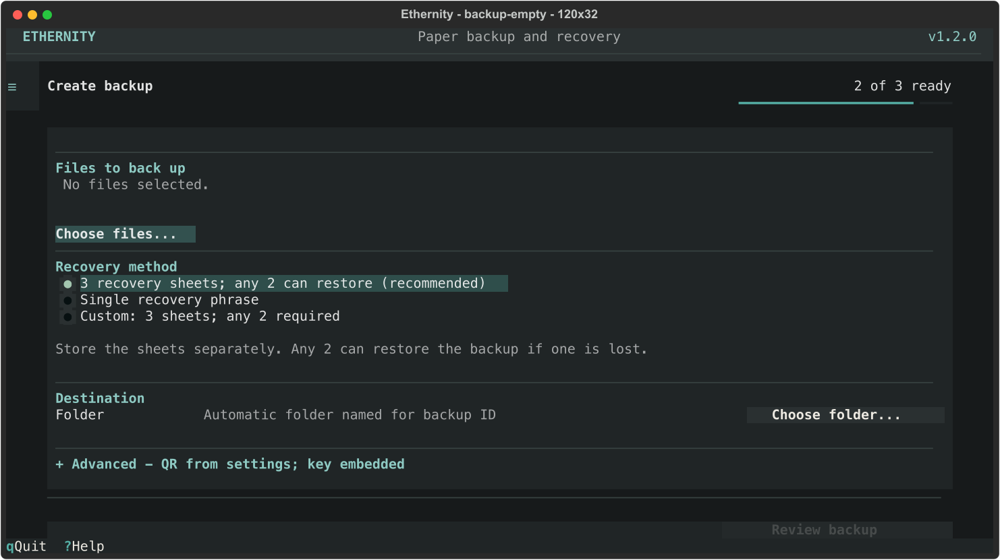

# Ethernity

[](https://github.com/MinorGlitch/ethernity/actions/workflows/ci.yml)
[](https://pypi.org/project/ethernity-paper/)
[](https://www.python.org/downloads/)
[](LICENSE)

Ethernity turns a small file or folder into an encrypted paper backup that you can recover offline.
It writes the encrypted data to QR and text recovery documents and can split the passphrase into
recovery sheets for storage in different places. By default, Ethernity creates three sheets and
requires any two for recovery.

Restore with the terminal app, the command line, or the offline browser recovery kit. Ethernity
does not require an account or online service.

Use Ethernity for seed phrases, private keys, certificates, and small sets of configuration files.
A backup can contain up to **1 MiB of ciphertext** and **2,048 paths**. Keep large archives, media
libraries, and routine snapshots in a conventional backup system.

<p align="center">
  <a href="images/readme/terminal_app_preview.png">
    
  </a>
</p>

## Installation

### Homebrew (macOS and Linux)

```sh
brew install minorglitch/tap/ethernity
```

### pipx

Ethernity requires Python 3.11 or newer.

```sh
pipx install ethernity-paper
```

The package is named `ethernity-paper`; the installed command is `ethernity`.

### Windows

Run the installer from PowerShell:

```powershell
Invoke-WebRequest "https://raw.githubusercontent.com/MinorGlitch/ethernity/master/install.ps1" -OutFile install.ps1
powershell -ExecutionPolicy Bypass -File .\install.ps1
```

Open a new terminal after installation.

### Release archives

Download archives for macOS, Linux, and Windows from
[GitHub Releases](https://github.com/MinorGlitch/ethernity/releases). Verify an archive with its
Sigstore bundle before you run it. The [release guide](docs/release_artifacts.md) shows the command.

Check the installation:

```sh
ethernity --help
```

## Quick start

Start with a disposable file. Complete a restore before you use Ethernity for material you care
about.

```sh
ethernity
```

1. Choose **Create backup** and add the test file.
2. Keep the recommended recovery setting: three sheets, any two required.
3. Create the backup and print the PDFs at actual size.
4. Choose **Restore files** and load the backup folder or scanned pages.
5. Restore into an empty destination and compare the result with the source file.

Use `ethernity run` from a shell or script. This POSIX shell example creates and restores a small
test backup:

```sh
printf "ethernity README test\n" > test-file.txt

ethernity run backup \
  --input ./test-file.txt \
  --output-dir ./backup-demo \
  --passphrase "ethernity test passphrase" \
  --yes

ethernity run restore \
  --scan ./backup-demo \
  --passphrase "ethernity test passphrase" \
  --output ./restored.txt \
  --yes

cmp ./test-file.txt ./restored.txt
```

`cmp` produces no output when the restored file matches the source.

## Storage and recovery

The QR and text documents contain the encrypted backup. Recovery sheets contain shares of the
passphrase. Store the sheets in separate places and keep them apart from the backup documents.

- Keep another backup outside Ethernity.
- Create and restore backups on a computer you trust.
- Treat each generated page as sensitive, including encrypted pages.
- Scan a printed QR code before you put the documents into storage.
- Test a restore with the documents and recovery sheets you plan to keep.

Browser recovery tools contain the software needed to restore a backup without installing
Ethernity; they do not contain your files. Add Files publishes a chain-bound replacement kit for
its new head. The expert `ethernity run print-kit` command creates an unanchored rescue kit, which
cannot prove that the supplied extension head is the expected latest state. Test either kind with
disposable data.

Read the [security policy](SECURITY.md) for the threat model and private vulnerability reporting
process.

## Command reference

Run `ethernity` for the guided terminal app. The same workflows are available for scripts:

| Command | Purpose |
| --- | --- |
| `ethernity run backup` | Create a backup |
| `ethernity run restore` | Restore files from backup documents or scans |
| `ethernity run add-files` | Add or replace files in an existing backup |
| `ethernity run rebuild` | Turn a backup history into one standalone set |
| `ethernity run replace-recovery-docs` | Create replacement recovery sheets |
| `ethernity run print-kit` | Create an unanchored browser rescue kit |
| `ethernity run doctor` | Inspect or repair an interrupted publication transaction |

Add `--preview` to inspect a task without writing files. Add `--json` when a script needs
machine-readable output. Run `ethernity run <command> --help` for all options.

## Documentation

- [Advanced workflows](docs/advanced-workflows.md) covers updates, rebuilds, trusted fingerprints,
  and replacement recovery sheets.
- [Format specification](docs/format.md) defines the backup and recovery format.
- [Extension operations profile](docs/extension_publication_profile.md) defines the normative v1.2
  publication, recovery-kit, and chain-maintenance rules.
- [Format notes](docs/format_notes.md) explains the design and operating model.
- [Compatibility history](docs/format_changes.md) records frozen release targets and shipped formats.
- [Release guide](docs/release_artifacts.md) explains archive and Sigstore verification.

## Contributing

```sh
git clone https://github.com/MinorGlitch/ethernity.git
cd ethernity
uv sync --extra dev --extra build
uv run ethernity --help
```

Read [CONTRIBUTING.md](CONTRIBUTING.md) for the test and formatting commands. Report security
problems through the private process in [SECURITY.md](SECURITY.md).

## License

Ethernity is licensed under the [GNU General Public License v3.0 or later](LICENSE).

[Paperback](https://github.com/cyphar/paperback) inspired the project.
[Rememory](https://github.com/eljojo/rememory) explores a related approach; Ethernity uses no
Rememory code or assets.
