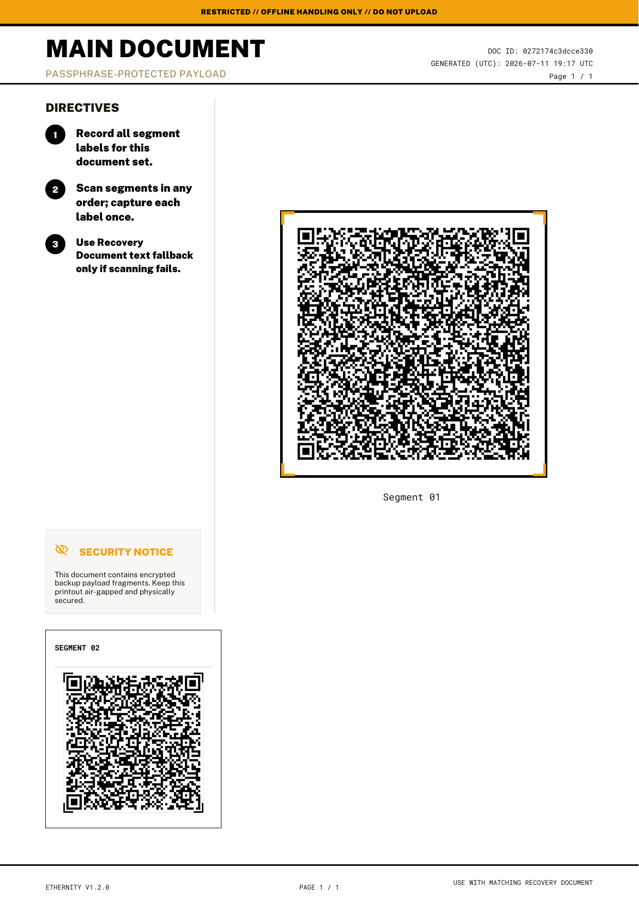
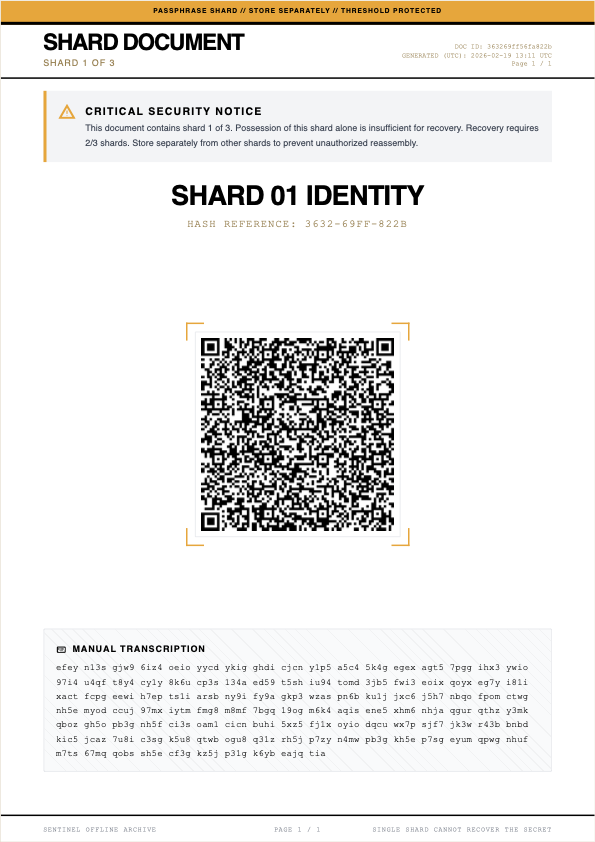
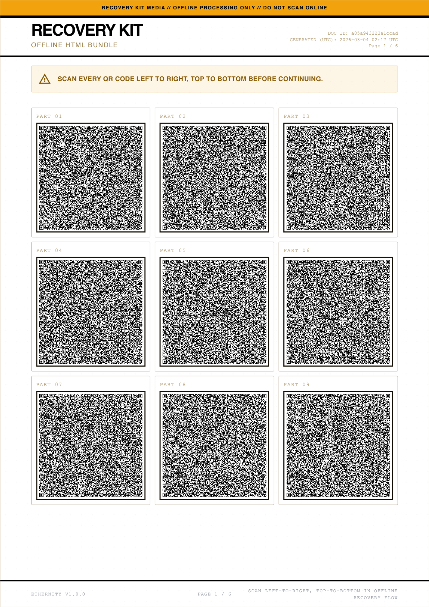
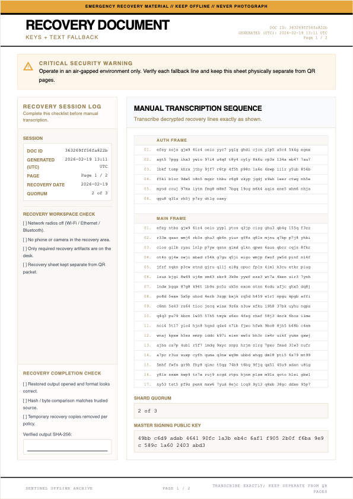

<a id="readme-top"></a>

[![Contributors][contributors-shield]][contributors-url]
[![Forks][forks-shield]][forks-url]
[![Stargazers][stars-shield]][stars-url]
[![Issues][issues-shield]][issues-url]
[![License][license-shield]][license-url]
[](https://www.python.org/downloads/)

<div align="center">
  
  <h1 align="center">Ethernity</h1>
  <p align="center">
    Encrypted paper backups for small, high-value files.
    <br />
    <a href="https://github.com/MinorGlitch/ethernity/wiki/Getting-Started"><strong>Getting Started</strong></a>
    &middot;
    <a href="https://github.com/MinorGlitch/ethernity/wiki/Backup-Workflow"><strong>Backup Workflow</strong></a>
    &middot;
    <a href="https://github.com/MinorGlitch/ethernity/wiki/Recovery-Workflow"><strong>Recovery Workflow</strong></a>
    &middot;
    <a href="docs/format.md"><strong>Format Spec</strong></a>
    &middot;
    <a href="SECURITY.md"><strong>Security Policy</strong></a>
  </p>
</div>

## What It Does

Ethernity turns a small file or directory into encrypted recovery documents you can print, store,
scan, and recover without network access.

A backup can include:

- `qr_document.pdf`: QR codes for machine recovery
- `recovery_document.pdf`: fallback text for manual recovery
- passphrase shard PDFs for quorum recovery
- signing-key shard PDFs for extension and mint workflows
- a browser recovery kit QR document

Use Ethernity for seed phrases, small key bundles, critical config files, and recovery packets that
need a paper path. Use a normal backup system for large archives, sync, and frequent background
snapshots.

## Install

macOS and Linux:

```sh
brew tap minorglitch/tap
brew install ethernity
ethernity --help
```

Python-managed install:

```sh
pipx install ethernity-paper
ethernity --help
```

Windows PowerShell:

```powershell
$ProgressPreference = 'SilentlyContinue'
Invoke-WebRequest "https://raw.githubusercontent.com/MinorGlitch/ethernity/master/install.ps1" -OutFile install.ps1
powershell -ExecutionPolicy Bypass -File .\install.ps1
ethernity --help
```

Verify release archives with [Release Artifacts](https://github.com/MinorGlitch/ethernity/wiki/Release-Artifacts)
before you run a downloaded binary.

## First Drill

Run this with test data before you protect anything real:

```sh
printf "ethernity test payload\n" > payload.txt

ethernity backup \
  --input ./payload.txt \
  --output-dir ./backup-demo \
  --passphrase "ethernity test passphrase"

ethernity recover \
  --scan ./backup-demo \
  --passphrase "ethernity test passphrase" \
  --output ./restored.txt

cmp ./payload.txt ./restored.txt
```

`cmp` prints nothing when the restored file matches. On Windows, use:

```powershell
fc.exe /b .\payload.txt .\restored.txt
```

## Pick A Workflow

| Need | Command | Result |
| --- | --- | --- |
| Create a backup set | `backup` | writes QR, fallback, and optional shard PDFs |
| Restore data | `recover` | restores from scans, payload text, or fallback text |
| Add changes to an unsealed backup | `extend` | writes a new generation under `extensions/` |
| Flatten root plus extensions | `compact` | writes a fresh standalone backup |
| Issue new shard PDFs | `mint` | writes replacement or fresh shard documents |
| Print the browser recovery kit | `kit` | writes a QR PDF for the offline kit |

Other useful commands:

```sh
ethernity config --onboard
ethernity render envelope-c6 --format pdf --output ./envelope_c6.pdf
ethernity api inspect recover --scan ./backup-demo --passphrase "ethernity test passphrase"
```

Use `ethernity <command> --help` for flags.

## When Files Change

Create the root backup once:

```sh
ethernity backup \
  --input-dir ./docs \
  --output-dir ./backup-root \
  --passphrase "example passphrase"
```

Preview an extension:

```sh
ethernity extend \
  --root-dir ./backup-root \
  --input-dir ./docs \
  --base-dir ./docs \
  --passphrase "example passphrase" \
  --dry-run
```

Publish the extension:

```sh
ethernity extend \
  --root-dir ./backup-root \
  --input-dir ./docs \
  --base-dir ./docs \
  --passphrase "example passphrase" \
  --shard-count 0
```

`extend` needs an explicit recovery policy. Choose extension shards with
`--shard-threshold N --shard-count K`, reuse root shards with `--unlock-policy reuse-root`, or use
`--shard-count 0` when your policy allows plaintext passphrase fallback text.

Recover the latest state:

```sh
ethernity recover \
  --scan ./backup-root \
  --passphrase "example passphrase" \
  --output ./restored-docs
```

Compact the chain when you want a new standalone set:

```sh
ethernity compact \
  --root-dir ./backup-root \
  --output-dir ./backup-compacted \
  --passphrase "example passphrase"
```

For the full operator flow, read
[Extension Workflow](https://github.com/MinorGlitch/ethernity/wiki/Extension-Workflow).

## Custody Basics

- Start with test data.
- Store QR documents, recovery documents, and shards in separate places.
- Keep one independent backup path outside Ethernity.
- Test the minimum shard quorum during recovery drills.
- Run a recovery drill before you trust a procedure.

Ethernity gives you recoverable artifacts. Your custody plan protects the passphrase, printed
pages, shard holders, and recovery environment.

## Recovery Kit

The browser recovery kit gives you an offline HTML recovery surface.

```sh
ethernity kit --output ./recovery_kit_qr.pdf
ethernity kit --variant scanner --output ./recovery_kit_scanner_qr.pdf
```

Use the default kit for file and paste workflows. Use the scanner variant when the browser should
handle camera input.

## Document Preview

Sentinel preview pages from the generated PDF set:

<p align="center">
  
  
  
  
</p>

Supported designs: `archive`, `forge`, `ledger`, `maritime`, `sentinel`.

Use [Template Gallery](https://github.com/MinorGlitch/ethernity/wiki/Template-Gallery) to compare
them.

## Docs

Operator guides:

- [Getting Started](https://github.com/MinorGlitch/ethernity/wiki/Getting-Started)
- [Backup Workflow](https://github.com/MinorGlitch/ethernity/wiki/Backup-Workflow)
- [Extension Workflow](https://github.com/MinorGlitch/ethernity/wiki/Extension-Workflow)
- [Recovery Workflow](https://github.com/MinorGlitch/ethernity/wiki/Recovery-Workflow)
- [Command Cheatsheet](https://github.com/MinorGlitch/ethernity/wiki/Command-Cheatsheet)
- [Troubleshooting](https://github.com/MinorGlitch/ethernity/wiki/Troubleshooting)
- [Release Artifacts](https://github.com/MinorGlitch/ethernity/wiki/Release-Artifacts)

Reference docs:

- [docs/format.md](docs/format.md): backup format specification
- [docs/format_notes.md](docs/format_notes.md): rationale and operations notes
- [docs/format_changes.md](docs/format_changes.md): compatibility ledger
- [docs/cli_api.md](docs/cli_api.md): NDJSON API contract
- [SECURITY.md](SECURITY.md): security policy

## Development

```sh
git clone https://github.com/MinorGlitch/ethernity.git
cd ethernity
uv sync --extra dev --extra build
uv run playwright install chromium
uv run ethernity --help
```

Core checks:

```sh
uv run ruff check src tests
uv run ruff format --check src tests
uv run mypy src
uv run pytest tests/unit tests/integration -q
cd kit
npm ci
npm test
node build_kit.mjs
```

Read [CONTRIBUTING.md](CONTRIBUTING.md) before opening a pull request.

## Credits

Ethernity was inspired by [Paperback](https://github.com/cyphar/paperback) by cyphar.

Mention: [Rememory](https://github.com/eljojo/rememory). Ethernity does not use Rememory code or
assets.

Ethernity uses these libraries:

- [age](https://github.com/FiloSottile/age) via [pyrage](https://github.com/str4d/rage)
- [PyCryptodome](https://github.com/Legrandin/pycryptodome)
- [Typer](https://github.com/fastapi/typer)
- [Rich](https://github.com/Textualize/rich)
- [Questionary](https://github.com/tmbo/questionary)
- [Playwright](https://playwright.dev/python/)

## License

GPLv3 or later. See [LICENSE](LICENSE).

<p align="right">(<a href="#readme-top">back to top</a>)</p>

[contributors-shield]: https://img.shields.io/github/contributors/MinorGlitch/ethernity.svg?style=for-the-badge
[contributors-url]: https://github.com/MinorGlitch/ethernity/graphs/contributors
[forks-shield]: https://img.shields.io/github/forks/MinorGlitch/ethernity.svg?style=for-the-badge
[forks-url]: https://github.com/MinorGlitch/ethernity/network/members
[stars-shield]: https://img.shields.io/github/stars/MinorGlitch/ethernity.svg?style=for-the-badge
[stars-url]: https://github.com/MinorGlitch/ethernity/stargazers
[issues-shield]: https://img.shields.io/github/issues/MinorGlitch/ethernity.svg?style=for-the-badge
[issues-url]: https://github.com/MinorGlitch/ethernity/issues
[license-shield]: https://img.shields.io/github/license/MinorGlitch/ethernity.svg?style=for-the-badge
[license-url]: https://github.com/MinorGlitch/ethernity/blob/master/LICENSE
