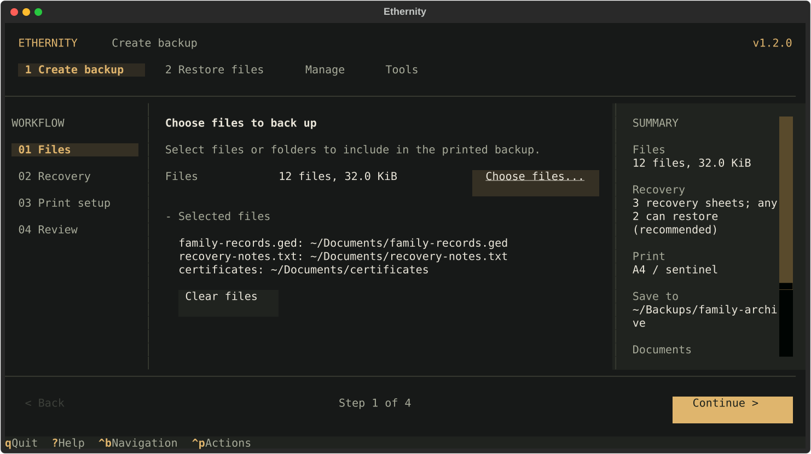

# Ethernity

[](https://github.com/MinorGlitch/ethernity/actions/workflows/ci.yml)
[](https://pypi.org/project/ethernity-paper/)

Ethernity encrypts small files and turns them into PDFs you can print. Recover your files offline
from QR codes or printed text, using the terminal app, command line, or browser recovery kit.
No account or online service is required.

Use it for seed phrases, private keys, certificates, and configuration files.

<p align="center">
  <a href="images/readme/terminal_app_preview.svg">
    
  </a>
</p>

## What you keep

Ethernity creates two kinds of pages:

- **Backup pages** contain your encrypted files as QR codes and text.
- **Recovery sheets** hold pieces of the passphrase that unlocks those files. By default, Ethernity
  creates three sheets; any two can reconstruct the passphrase.

To restore, you need the backup pages and enough recovery sheets, or the passphrase itself.
Keep the recovery sheets in separate places, apart from the backup pages.

A standalone backup supports up to 2,048 files and 1 MiB of encrypted data. The size limit applies
after compression and encryption.

## Install

### macOS and Linux

```sh
brew install minorglitch/tap/ethernity
```

### Windows

Run in PowerShell, then open a new terminal:

```powershell
Invoke-WebRequest "https://raw.githubusercontent.com/MinorGlitch/ethernity/master/install.ps1" -OutFile install.ps1
powershell -ExecutionPolicy Bypass -File .\install.ps1
```

### With Python

If you use pipx, install with Python 3.11 or newer:

```sh
pipx install ethernity-paper
```

The package name is `ethernity-paper`; the command is `ethernity`.

You can also download an archive from [GitHub Releases](https://github.com/MinorGlitch/ethernity/releases).
See [release verification](docs/release_files.md#verification-example) for signature checks.

## Make a backup and try restoring it

Start the terminal app:

```sh
ethernity
```

1. Choose **Create backup** and add a test file.
2. Keep the default recovery setting: three sheets, any two needed.
3. Choose a paper size and destination, review the backup, and create it. Ethernity saves the PDFs
   in a new `backup-<id>` folder inside that destination.
4. Print the PDFs at actual size.
5. Choose **Restore files**. Load scans of the backup pages and any two recovery sheets.
6. Restore to a new destination and compare the result with your test file.

While a task runs, the app shows its current stage, elapsed time, and file or PDF page counts.
Cancel waits for the current operation to stop and removes temporary output. Once the final save
begins, cancellation is disabled. A failed or cancelled task lets you return to your form choices.

Test the printed copies you plan to store. Keep another backup of important files.

For recovery in a browser, keep a copy of the
[offline recovery kit](docs/advanced_operations.md#create-a-reusable-offline-browser-recovery-kit).
The kit contains the recovery software, works across backups, and can also be printed.

## Update a backup

Choose **Manage > Add files** to add new files or replace existing ones without reprinting the
whole backup.

Updates are cumulative by default. To restore a version, keep the original backup, that update,
and your recovery sheets. Earlier updates are only needed if you want their earlier versions.

Incremental updates can reduce printing further, but recovery needs every update through the
version you want. Choose the mode when you start an update series.

Use **Rebuild backup** to make a new standalone backup from the current files. See
[updates and rebuilds](docs/advanced_operations.md) for examples and recovery requirements.

## Use from a script

`ethernity run` provides the same operations as commands. For example, back up a folder:

```sh
ethernity run backup --input ./documents --output-dir ./paper-backup --yes
```

This creates `./paper-backup/backup-<id>/` with the backup documents and default recovery sheets.
The destination is always a parent folder; Ethernity creates it if needed. Without `--output-dir`,
the parent is the current folder. Replace `--yes` with `--preview` to check the operation without
creating files.

Run `ethernity run --help` to list commands, or `ethernity run restore --help` for restore options.

## Documentation and development

- [Security](SECURITY.md): what Ethernity protects against and how to report a vulnerability.
- [Format specification](docs/format.md) and [design rationale](docs/format_rationale.md).
- [Update format and recovery rules](docs/extension_publication_rules.md).
- [Format compatibility](docs/format_history.md), including support for older backups.
- [Contributing](CONTRIBUTING.md): development setup and tests.

## License and credits

Ethernity is licensed under the [GNU General Public License v3.0 or later](LICENSE).

[Paperback](https://github.com/cyphar/paperback) inspired the project.
[Rememory](https://github.com/eljojo/rememory) takes a related approach; Ethernity uses no Rememory
code or assets.
